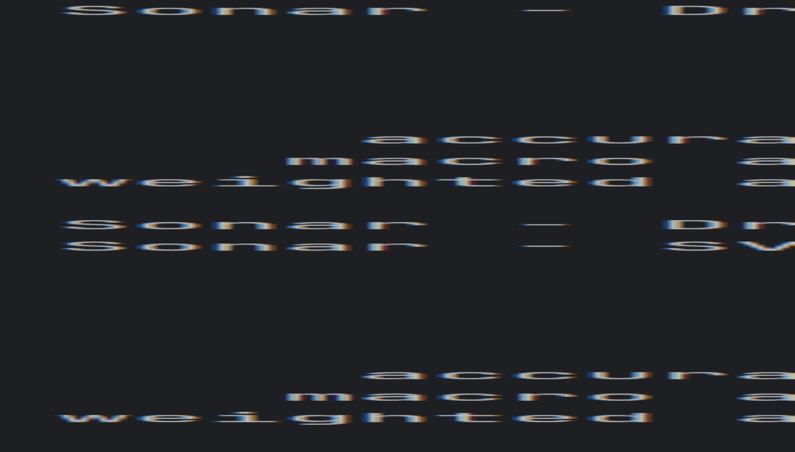

# Klasyfikacja Danych: Neural Network

Aplikacja służy do klasyfikacji danych za pomocą Sieci Neuronowych oraz wizualizacji danych.

Autorzy: Tomasz Wasielewski (s24280); Karol Sielski (s25)

## Instrukcja uruchomienia

1. **Sklonowanie repozytorium**:
   ```bash
   git clone
   cd NeuralNetwork
   ```

# Utworzenie i aktywacja środowiska wirtualnego: Na systemach Unix (Linux/macOS):
```bash
python3 -m venv .venv
source .venv/bin/activate
```

# Na systemie Windows:
```bash
python -m venv .venv
.venv\Scripts\activate
```

# Instalowanie zależności
```bash
pip install -r requirements.txt
```

# Uruchomienie aplikacji: 
Aby uruchomić skrypt CIFAR-10:
```bash
cd cifar-10-classifier
python cifar-10.py
```

Aby uruchomić skrypt Sonar:
```bash
cd sonar-data-classifier
python cifar-10.py
```

Aby nauczyć model i uruchomić predykcję - model NN (fshion-mnist):
```bash
cd nashion-mnist-classifier
python train.py
python predict.py
```


Jako 4 przykład z odrębnym zbiorem danych wybraliśmy zbiór danych na temat rozróżniania skóry ludzkiej na obrazie.
Zbiór dostępny jest tutaj: https://archive.ics.uci.edu/dataset/229/skin+segmentation

Aby nauczyć model i uruchomić predykcję - model NN (skin-segmentation):
```bash
cd skin-segmentation-classifier
python train.py
python predict.py
```

# 1. Porównanie wyników klasyfikacji dla różnych algorytmów
Na podstawie przeprowadzonych eksperymentów z danymi Sonar porównano skuteczność trzech algorytmów klasyfikacyjnych: 
drzewa decyzyjnego, SVM oraz sieci neuronowej. 

Poniżej zestawiono kluczowe obserwacje:

1.1 Dokładność:
SVM osiągnęło najwyższą dokładność (85.71%), co wskazuje na jego skuteczność w klasyfikacji sygnałów sonarowych.
Sieć neuronowa uzyskała wynik 83.17%, będąc niewiele gorszą od SVM, co sugeruje potencjał przy odpowiedniej optymalizacji.
Drzewo decyzyjne osiągnęło najniższą dokładność (71.43%), co pokazuje jego ograniczenia w przypadku bardziej złożonych
danych.

1.2 Zrównoważenie wyników dla klas:
SVM lepiej balansuje precyzję i czułość obu klas (skały i miny), co czyni go najbardziej niezawodnym w tej analizie.
Sieć neuronowa była bliska pod względem wyników, lecz jej skuteczność zależy od konfiguracji hiperparametrów.
Drzewo decyzyjne radzi sobie gorzej z identyfikacją obu klas, co wskazuje na problemy z bardziej skomplikowanymi 
granicami decyzyjnymi.

1.3 Wnioski:
SVM okazało się najbardziej efektywne w tym przypadku.
Sieci neuronowe mają potencjał, ale wymagają optymalizacji hiperparametrów i architektury.
Drzewo decyzyjne jest prostsze w implementacji i szybkie w trenowaniu, lecz jego dokładność była najniższa.
Dalsza optymalizacja sieci neuronowej, w tym dostosowanie architektury i procesu uczenia, mogłaby poprawić jej wyniki i 
potencjalnie przewyższyć SVM.


# Wywołanie SVM i DT dla danych sonarowych:


# Wywołanie NN dla danych sonarowych:


# Uczenie modelu małej i dużej sieci:


# Wyniki predykcji dla modelu małej i dużej sieci:


Rozmiar i głębokość sieci nie mają znaczącego wpływu na wynik przy tak małej skali klasyfikacji i różnorodności dancyh.

# Confussion matrix


